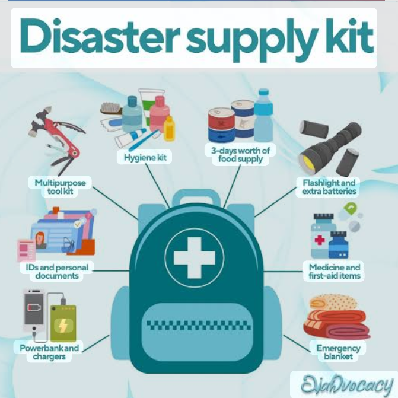
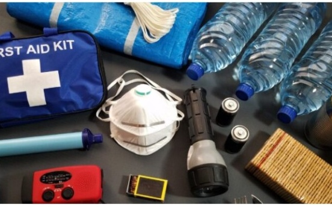
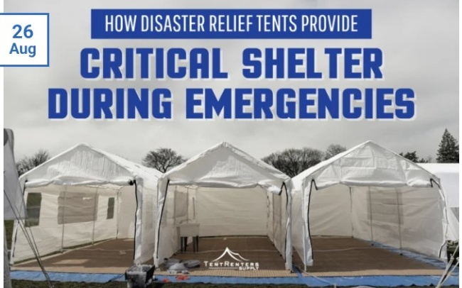
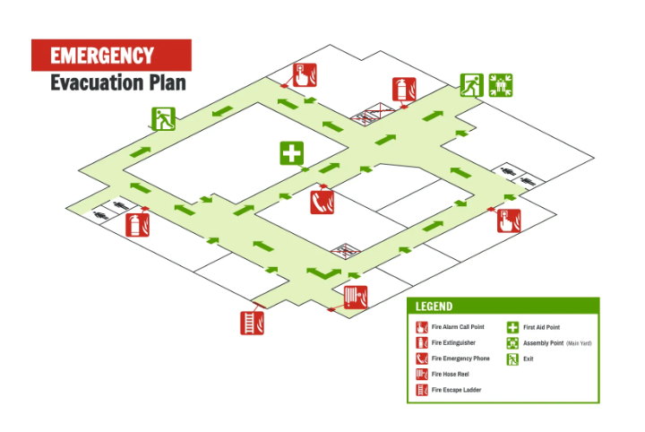
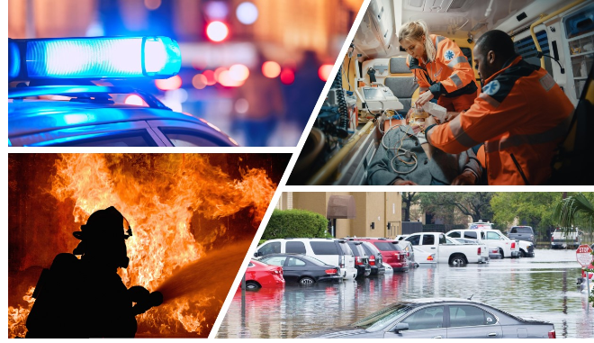

# SMART SHELTER AND RESOURCE FINDER 

## PROBLEM STATEMENT 

During disasters such as floods, cyclones, earthquakes, and other emergencies, people often struggle to find nearby safe shelters and essential resources like food, water, and medical aid. In such situations, finding reliable information quickly can be difficult.

The Smart Shelter and Resource Finder is an AI-powered platform designed to help people quickly identify nearby safe shelters and available essential resources based on their location and needs. It aims to provide useful information and simple safety guidance during emergency situations.

The main goal is to make disaster-related information easier to access and help people find the right assistance at the right time.
## DISASTER PREPAREDNESS 
### DISASTER SUPPLY KIT 

A disaster supply kit contains essential items such as food, drinking water, first-aid supplies, medicines, flashlights, batteries, hygiene products, blankets, and other emergency equipment. Having these supplies ready can help people stay prepared during disasters and emergencies.
### EMERGENCENCY SUPPLIES 

Essential emergency supplies such as first-aid kits, drinking water, flashlights, batteries, masks, and other basic equipment can provide immediate support when normal services are unavailable during a disaster.
### EMERGENCY SHELTER 

Emergency shelters provide a safe temporary place for people affected by disasters. Our platform helps users identify nearby shelters and access information about available assistance and essential resources.
### EVACUATION MAP 

An evacuation map shows safe routes, emergency exits, shelters, and important locations during a disaster. It helps people understand where to go and which routes to follow to reach a safe place quickly. An AI-powered system can use a person's location and available map information to suggest a suitable nearby shelter and safer route.
### EMERGENCY DISASTER RESPONSE

Emergency disaster response involves providing immediate help to people affected by floods, cyclones, earthquakes, and other emergencies. This may include locating people who need assistance, finding available shelters, and connecting them with essential resources such as food, water, and medical support. An AI system can help organize requests and prioritize urgent needs so that assistance can be coordinated more effectively.

